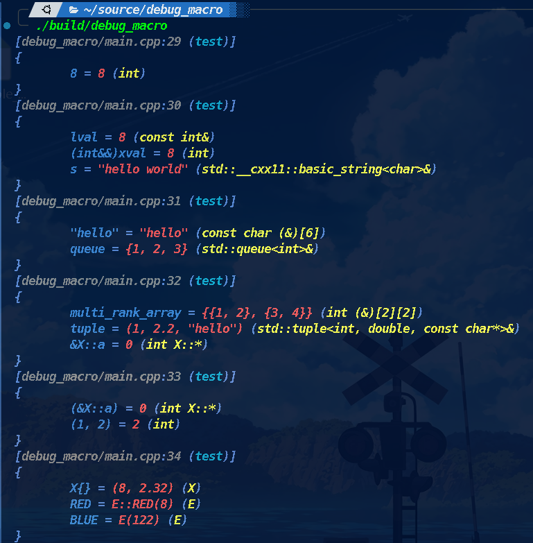

<div align="center">
  
</div>

<div align="center">
  <h1 align="center">🌈 debug_macro</h1>
  <p align="center">
    <i><b>一个现代、强大的C++23日志输出库</b></i>
    <br />
    <a href="docs/references/"><strong>document »</strong></a>
   <br />
    <br />
    <a href="https://github.com/RFoe/debug_macro/issues"><i>bug report</i></a>
    ·
    <a href="https://github.com/RFoe/debug_macro/issues"><i>feature request</i></a>
  </p>
</div>

## _容器适配器_ 项目状态

[](https://github.com/RFoe/debug_macro)
[](https://github.com/RFoe/debug_macro)
[](https://github.com/RFoe/debug_macro/blob/main/LICENSE)
[](https://en.cppreference.com/w/cpp/compiler_support)
[](https://github.com/RFoe/debug_macro/actions)
[](https://github.com/RFoe/debug_macro/actions)

## 📋 目录

- [🌟 项目概述](#-项目概述)
- [✨ 特性](#-特性)
- [🔧 安装](#-安装)
- [📖 使用指南](#-使用指南)
- [🎨 类型定制](#-类型支持)
- [🗺️ 路线图](#-路线图)
- [🤝 贡献](#-贡献)
- [📄 许可证](#-许可证)
- [📞 联系](#-联系)

## 🌟 项目概述

`debug_macro` 是一个现代化的C++23日志输出库，专为开发者提供直观、强大的调试输出工具。受Rust `dbg!()` 宏启发，致力于简化日志记录和调试过程。

## ✨ 特性

- 🌈 **彩色日志输出**
- 🔧 *跨平台支持* (Unix/Windows)
- 📦 _`Header-only`_ 库，零依赖
- 🖥️ 支持**几乎所有C++可打印类型**
- 🛠️ 编译器兼容性 (Clang/GCC/MSVC)
- 🚀 _`C++23`_ 标准支持
- 💡 智能类型推导和格式化输出

### 🖼️ 性能基准测试


## 🔧 安装

### 要求
- _`C++23`_ 兼容编译器
- 无额外依赖

### 方法一：直接包含
```cpp
#include "debug_macro.hpp"
```

### 方法二：CMake集成
```cmake
# CMakeLists.txt
cmake_minimum_required(VERSION 3.11) # FetchContent added in cmake 3.11
project(app VERSION 0.1.0 LANGUAGES C CXX) # name of executable

set(CMAKE_CXX_STANDARD 23)
set (CMAKE_CXX_STANDARD_REQUIRED on)
# debug-macro
include(FetchContent)

FetchContent_Declare(debug_macro GIT_REPOSITORY https://github.com/RFoe/debug_macro)
FetchContent_MakeAvailable(debug_macro)

add_executable(${PROJECT_NAME} main.cpp) # your source files goes here
target_link_libraries(${PROJECT_NAME} PRIVATE debug_macro) # make debug_macro.hxx available
```

## 📖 使用指南

### 基本用法
```cpp
int x = 10;
std::string name = "debug_macro";
debug_macro(x, name);
```

### 复杂类型
```cpp

struct X
{
  int a = 8;
  double b = 2.32;
};

enum E : unsigned char
{
  RED = 8,
  BLUE = 122,
};

namespace {

void
test()
{
  int const lval = 8;
  int&& xval = 8;

  std::string s{ "hello world" };

  int multi_rank_array[][2]{
    { 1, 2 },
    { 3, 4 },
  };

  std::tuple tuple{ 1, 2.2, "hello" };
  std::queue<int> queue{ { 1, 2, 3 } };
  
  debug_macro(8);
  debug_macro(lval, (int&&)xval, s);
  debug_macro("hello", queue);
  debug_macro(multi_rank_array, tuple, &X::a);
  debug_macro((&X::a), (1, 2));
  debug_macro(X{}, RED, BLUE);
}

}
```




## 🎨 类型定制

```cpp
// 正确的自定义 formatter 实现
template <>
struct std::formatter<YourCustomType> : std::formatter<std::string> {
    // 注意 const 修饰符
    auto format(const YourCustomType& obj, format_context& ctx) const {
        return std::format_to(ctx.out(), "CustomType(value={})", obj.value);
    }
};
```
### Formatter 的 `const` 要求

⚠️ **_重要提示_**：在 `libstdc++` 中，`std::formatter` 的 `format()` 方法**必须**声明为 `const`。这是由于 `__formattable_with` 的 `requires` 表达式强制要求 `formatter` 对象在格式化过程中保持不变。

## 🌟 类型支持


_`debug_macro`_ 支持*广泛的类型输出*，包括但不限于：

### _字符串相关类型_
- `std::string`
- `std::string_view`
- `char`
- `char[]`
- `const char*`

### _容器类型_(**_std::ranges::range_**)
- `std::vector`
- `std::list`
- `std::deque`
- `std::array`
- `std::set`/`std::multiset`
- `std::map`/`std::multimap`

### _容器适配器_
- `std::queue`
- `std::priority_queue`
- `std::stack`

### _Tuple-like_
- `std::tuple`
- `std::pair`
- `aggregate struct`

### _枚举_(**_支持打印枚举名称_**)
- std::is_enum_v
- std::is_scoped_enum_v

### _Others_
- `std::optional`
- `std::unique_ptr | std::shared_ptr | std::weak_ptr`
- _`... And more`_

## 🗺️ 路线图

- [ ] 性能优化
- [ ] 更多平台测试
- [ ] 扩展格式化选项
- [ ] 性能基准测试

## 🤝 贡献

我们欢迎各种形式的贡献！请参见 `CONTRIBUTING.md`。

1. Fork 项目
2. 创建特性分支 (`git checkout -b feature/AmazingFeature`)
3. 提交更改 (`git commit -m 'Add some AmazingFeature'`)
4. 推送到分支 (`git push origin feature/AmazingFeature`)
5. 打开 Pull Request

## 📄 许可证

基于 MIT 许可证发布。详见 `LICENSE`。

## 📞 联系

- 项目链接: [GitHub仓库](https://github.com/RFoe/debug_macro)
- 问题反馈: [创建 Issue](https://github.com/RFoe/debug_macro/issues)

---

**💡 提示**: 持续更新中，欢迎 Star 和 Fork！🌟
